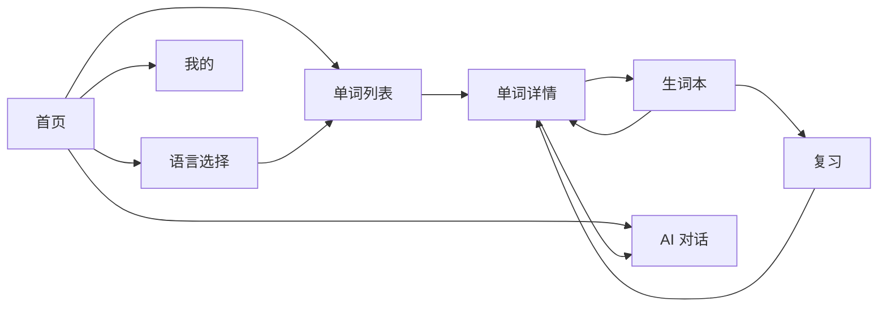

# MultiLearn 小程序设计稿说明

本文档是一套本地设计稿蓝图，用于指导微信原生小程序页面实现。设计目标是简洁、清晰、适合自用，优先保证学习路径顺畅、信息密度适中、后续扩展方便。

## 1. 产品定位

MultiLearn 是一个自用多语种在线教育微信小程序，首版支持英语、日语、韩语。第一版以本地词库和本地学习记录为主，AI 对话通过后端 HTTP 接口代理 Qwen 模型，前端不保存也不暴露 API Key。

核心路径：

1. 打开首页查看今日学习状态
2. 选择语言和等级词库
3. 浏览单词列表
4. 查看单词详情、加入生词本
5. 在复习页按本地记录复习
6. 在 AI 对话页进行场景练习
7. 在我的页面查看本地统计和设置入口

## 2. 视觉规范

### 2.1 设计尺寸

- 主要画板：`375 x 812`
- 安全边距：左右 `20px`
- 页面背景：浅灰色
- 内容区域：卡片式，但避免过多装饰
- 底部导航高度：`80px`

### 2.2 色彩

| 用途 | 颜色 | 说明 |
| --- | --- | --- |
| 页面背景 | `#F7F8FA` | 页面主背景 |
| 卡片背景 | `#FFFFFF` | 内容卡片 |
| 主文本 | `#172033` | 标题和重要内容 |
| 次文本 | `#667085` | 描述、释义、辅助内容 |
| 弱文本 | `#98A2B3` | 占位、非激活状态 |
| 分割线 | `#E5E7EB` | 卡片描边、分割线 |
| 主色 | `#2563EB` | 主要按钮、选中态、英语 |
| 成功色 | `#10B981` | 已掌握、正确、进度 |
| 警示色 | `#F59E0B` | 待复习、日程提醒 |
| 强提醒 | `#EF4444` | 不认识、今日到期 |
| 日语辅助色 | `#EC4899` | 日语语言标识 |
| 深色按钮 | `#111827` | 次要强操作 |

浅色标签背景：

- 蓝色：`#DBEAFE`
- 绿色：`#D1FAE5`
- 橙色：`#FEF3C7`
- 粉色：`#FCE7F3`
- 红色：`#FEE2E2`

### 2.3 字体层级

微信小程序里使用系统字体即可，不需要引入外部字体。

| 场景 | 字号 | 字重 |
| --- | --- | --- |
| 页面主标题 | `22px` | `600/700` |
| 导航标题 | `18px` | `600` |
| 卡片标题 | `16-18px` | `600` |
| 单词主展示 | `36-40px` | `700` |
| 正文 | `14-16px` | `400` |
| 辅助文本 | `12-13px` | `400` |
| 按钮文字 | `15px` | `600` |

### 2.4 圆角与间距

- 页面左右边距：`20px`
- 卡片圆角：`12px`
- 大卡片圆角：`16-20px`
- 按钮圆角：`10px`
- 标签圆角：`14px`
- 卡片内边距：`16-20px`
- 卡片垂直间距：`12-16px`
- 列表项高度：`72-76px`

## 3. 页面结构总览

当前项目页面对应关系：

| 页面 | 目录 | 说明 |
| --- | --- | --- |
| 首页 | `miniprogram/pages/index` | 今日学习概览和快捷入口 |
| 语言选择页 | `miniprogram/pages/language` | 选择英语、日语、韩语 |
| 单词列表页 | `miniprogram/pages/words` | 展示当前词库单词 |
| 单词详情页 | `miniprogram/pages/word-detail` | 单词释义、例句、收藏 |
| 生词本页 | `miniprogram/pages/vocab` | 本地生词记录 |
| 复习页 | `miniprogram/pages/review` | 卡片式复习 |
| AI 对话页 | `miniprogram/pages/chat` | 场景化语言练习 |
| 我的页面 | `miniprogram/pages/profile` | 学习统计和设置 |

底部导航建议显示：

1. 首页
2. 生词
3. 复习
4. AI
5. 我的

语言选择、单词列表、单词详情可以作为首页路径下的二级页面，不一定出现在底部导航中。

## 4. 页面设计

### 4.1 首页

路径：`miniprogram/pages/index`

目标：让用户快速知道今天学什么、学到哪里、下一步做什么。

页面结构：

- 顶部问候区
  - 标题：`Hi, Dawn`
  - 副标题：`今天继续完成 15 分钟学习`
- 学习进度主卡片
  - 品牌：`MultiLearn`
  - 文案：`英语 A1 · 日语 N5 · 韩语入门`
  - 总进度条，例如 `63%`
- 语言快捷入口
  - 英语
  - 日语
  - 韩语
- 今日任务
  - 学习 10 个新词
  - 复习生词本
  - AI 口语练习

交互建议：

- 点击语言快捷入口进入 `pages/words`
- 点击今日任务进入对应页面
- 进度数据来自本地缓存

### 4.2 语言选择页

路径：`miniprogram/pages/language`

目标：选择本次学习语言和词库。

页面结构：

- 页面标题：`选择你今天要学习的语言`
- 辅助说明：`每种语言先从入门词库开始，进度保存在本地。`
- 语言卡片列表
  - 英语：`EN · A1`，示例 `Good morning`
  - 日语：`JA · N5`，示例 `おはよう`
  - 韩语：`KO · Beginner`，示例 `안녕하세요`
- 底部主按钮：`开始学习`

交互建议：

- 选中语言卡片后高亮边框或背景
- 点击开始学习进入对应词库列表
- 语言编码使用 `en`、`ja`、`ko`

### 4.3 单词列表页

路径：`miniprogram/pages/words`

目标：浏览当前语言和等级的本地词库。

页面结构：

- 导航标题：例如 `英语 A1 词库`
- 搜索框：`搜索单词 / 中文释义`
- 筛选标签
  - 全部
  - 新词
  - 已掌握
  - 收藏
- 单词卡片列表
  - 单词
  - 中文释义
  - 等级标签，例如 `A1`

单词卡片示例：

```text
hello
你好
A1
```

交互建议：

- 点击单词卡片进入 `pages/word-detail`
- 搜索仅在本地数组中过滤
- 筛选状态存在页面 state 即可，不需要持久化

### 4.4 单词详情页

路径：`miniprogram/pages/word-detail`

目标：展示单词完整信息，并提供加入生词本、发音和 AI 扩展示例入口。

页面结构：

- 单词主卡片
  - 单词，例如 `hello`
  - 音标，例如 `/həˈloʊ/`
  - 状态标签：`已加入生词本`
  - 操作按钮：`播放发音`、`加入生词本`
- 释义卡片
  - 词性和中文释义
- 例句卡片
  - 外语例句
  - 中文翻译
  - AI 扩展提示

交互建议：

- 加入生词本写入本地缓存
- 播放发音首版可先使用系统 TTS 或留空提示
- AI 例句后续可跳转到 `pages/chat` 并带入当前单词

### 4.5 生词本页

路径：`miniprogram/pages/vocab`

目标：集中展示用户标记的生词和复习状态。

页面结构：

- 页面标题：`待复习`
- 副标题：`本地保存 18 个生词`
- 统计面板
  - 生词数
  - 今日复习数
  - 掌握率
- 生词列表
  - 单词
  - 中文释义
  - 复习状态标签

状态标签建议：

- `今天`：红色
- `明天`：橙色
- `后天`：蓝色
- `已掌握`：绿色

交互建议：

- 点击生词进入详情页
- 长按或按钮操作可移出生词本
- 数据来源统一从本地缓存读取

### 4.6 复习页

路径：`miniprogram/pages/review`

目标：用卡片方式快速复习本地生词。

页面结构：

- 页面标题：`复习卡片`
- 副标题：`根据本地复习记录安排`
- 中央复习卡片
  - 语言等级标签，例如 `英语 A1`
  - 单词，例如 `teacher`
  - 音标
  - 提示文案：`点击查看释义`
- 操作按钮
  - `认识`
  - `不认识`
- 复习进度
  - 进度条
  - 当前数量，例如 `6 / 20`

交互建议：

- 点击卡片切换显示释义
- 点击认识：更新掌握状态或延后复习
- 点击不认识：保留在近期复习队列
- 所有记录写入本地缓存

### 4.7 AI 对话页

路径：`miniprogram/pages/chat`

目标：通过后端接口进行目标语言场景练习。

页面结构：

- 安全提示条
  - `通过后端函数调用 Qwen，前端不保存 API Key。`
- AI 欢迎气泡
  - `选择一个主题，我来陪你用目标语言练习。`
- 主题标签
  - 点餐
  - 旅行
  - 自我介绍
- 对话气泡区
  - 用户气泡靠右
  - AI 气泡靠左
- 底部输入栏
  - 输入框
  - 发送按钮

交互建议：

- 页面只请求自己的后端 HTTP 触发器
- 请求封装在 `miniprogram/services/request.ts`
- AI 业务封装在 `miniprogram/services/ai.ts`
- 聊天记录首版可以只保存在页面 state，后续再决定是否本地持久化

### 4.8 我的页面

路径：`miniprogram/pages/profile`

目标：展示本地学习统计和项目设置入口。

页面结构：

- 用户信息
  - 头像占位
  - 昵称，例如 `Dawn`
  - 描述：`本地学习数据 · 自用版`
- 本周学习面板
  - 学习天数
  - 学习词数
  - 学习分钟数
- 设置列表
  - 学习进度
  - 缓存管理
  - 关于项目
- 操作按钮
  - `导出学习数据`

交互建议：

- 缓存管理可以显示本地存储 key 和清理入口
- 导出学习数据首版可复制 JSON 到剪贴板
- 关于项目展示技术栈和数据说明

## 5. 组件建议

第一版不需要过度组件化，推荐只抽取高复用、稳定的组件。

可复用组件：

- `navigation-bar`：项目已有
- 语言卡片：可先写在页面内，后续再抽组件
- 单词卡片：列表页和生词本都用到，可考虑后续抽成组件
- 标签样式：用 Less mixin 或公共 class
- 底部 tab：使用小程序原生 tabBar 配置优先

不建议首版抽象：

- 复习卡片
- AI 气泡
- 统计面板

这些组件在首版业务变化可能较多，先保留在页面内更直观。

## 6. 数据与状态对应

### 6.1 本地词库

词库文件：

- `miniprogram/vocabularies/en-a1.json`
- `miniprogram/vocabularies/ja-n5.json`
- `miniprogram/vocabularies/ko-beginner.json`

页面使用：

- 首页显示总体进度
- 语言页显示语言和等级
- 单词列表页读取对应 JSON
- 详情页根据单词 id 查找详情

### 6.2 本地缓存

建议缓存内容：

- 当前选择语言
- 学习进度
- 生词本
- 复习记录
- 最近学习日期

统一通过：

- `miniprogram/utils/storage.ts`

### 6.3 接口请求

AI 对话请求只从前端请求自己的后端接口：

- `miniprogram/services/request.ts`
- `miniprogram/services/ai.ts`

前端禁止出现：

- Qwen API Key
- 阿里云 AccessKey
- 任何模型服务密钥

## 7. 页面跳转关系



## 8. 首版实现优先级

1. 确认 `app.json` 页面和 tabBar 配置
2. 完成首页、语言选择、单词列表、详情页主流程
3. 接入本地 JSON 词库
4. 完成本地缓存封装和生词本
5. 完成复习页的认识/不认识逻辑
6. 完成 AI 对话页 UI 和请求封装
7. 完成我的页面统计和缓存管理入口

## 9. 设计验收标准

- 8 个页面都能从当前项目目录找到对应实现
- 页面背景、卡片、按钮、标签风格统一
- 文本不溢出，不遮挡底部导航
- 所有学习数据来自本地 JSON 或本地缓存
- AI 对话页没有任何前端密钥
- 页面样式简洁，不引入跨端框架或 UI 框架
